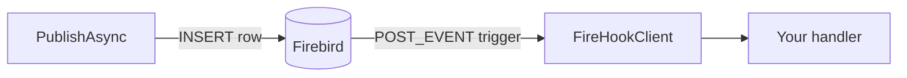

# FireHook

Pub/sub for Firebird. Clients on the same database publish and subscribe to named events with no extra infrastructure.

Firebird's `POST_EVENT` rings a bell. FireHook stores the payload in `FIREHOOK_EVENTS`, notifies all connected clients, and dispatches to their registered handlers.



## Schema

Created automatically on first run:

```sql
CREATE TABLE FIREHOOK_EVENTS (
    ID          BIGINT GENERATED BY DEFAULT AS IDENTITY PRIMARY KEY,
    EVENT_NAME  VARCHAR(128) NOT NULL,
    PAYLOAD     BLOB SUB_TYPE TEXT,
    FIRED_AT    TIMESTAMP DEFAULT CURRENT_TIMESTAMP NOT NULL,
    PROCESSED   SMALLINT DEFAULT 0 NOT NULL  -- 0=pending  1=done  -1=dead-letter
);

CREATE TRIGGER FIREHOOK_POST_EVENT
  AFTER INSERT ON FIREHOOK_EVENTS AS BEGIN
    POST_EVENT NEW.EVENT_NAME;
  END;
```

## Usage

### Subscribe

```csharp
var client = new FireHookClient(connectionString, new SubscriptionRegistry());

client.Subscribe("order.created", async evt =>
{
    var order = JsonSerializer.Deserialize<Order>(evt.Payload!);
});

await client.StartAsync();
await Task.Delay(Timeout.Infinite, cancellationToken);
await client.StopAsync();
```

### Publish

```csharp
// anonymous payload
await client.PublishAsync("order.created", new { OrderId = 42, Total = 99.99 });

// typed payload
await client.PublishAsync<OrderCreatedEvent>("order.created", orderEvent);

// no stored row, just rings the bell
await client.PingAsync("heartbeat");
```

Publish-only (no local subscriber):

```csharp
await client.EnsureSchemaAsync();
await client.PublishAsync("order.created", payload);
```

## Delivery

- At-least-once: rows are marked processed only after a successful dispatch
- Use the event `Id` as an idempotency key in handlers
- Dead-lettered rows (`PROCESSED = -1`) can be inspected or replayed manually
